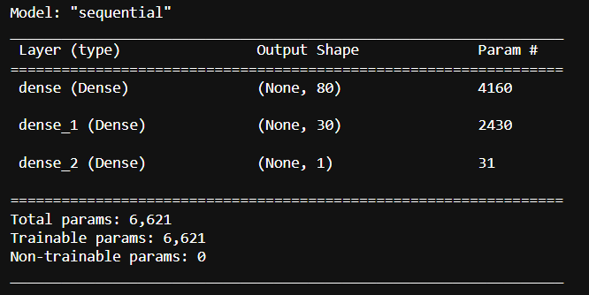
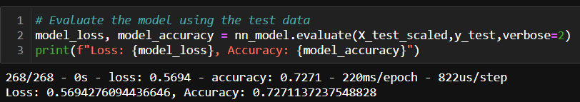
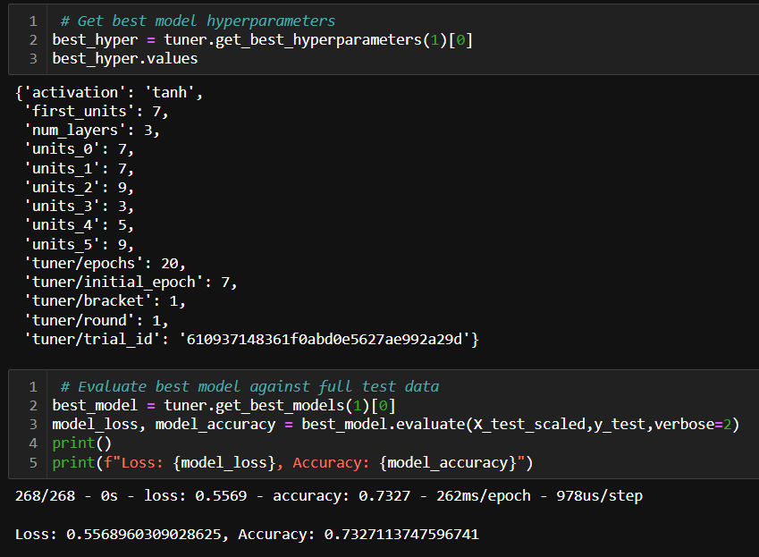

# deep_learning
a demonstration of deep learning and neural networks

# Intro

The purpose of this project was to use exercise some concepts of Deep Learning in Machine Learning Models, to see if a binary classifier could be constructed to predict if a charity funded by Alphabet Soup would be successful based on the information acquired covering 34,000 charities that had received funding from Alphabet Soup over the years.

# Data Set 

EIN and NAME—Identification columns

APPLICATION_TYPE—Alphabet Soup application type

AFFILIATION—Affiliated sector of industry

CLASSIFICATION—Government organization classification

USE_CASE—Use case for funding

ORGANIZATION—Organization type

STATUS—Active status

INCOME_AMT—Income classification

SPECIAL_CONSIDERATIONS—Special consideration for application

ASK_AMT—Funding amount requested

**====== Target ======**

IS_SUCCESSFUL—Was the money used effectively

# Method

First step was to load the information and get a good look at the information present to determine if any information would be dropped before the building of the Neural Network model (N.N.).

#### Pre-Processing:

The string information classifying the charities by name was unnecessary and was removed. Afterwards we took a look at the number of unique values to understand which columns of the data set would have a higher impact on the data. Once considered it was understood that we would need to reduce the impact of uncommon/rare data values in columns that could present a bias to the model during training. These values were binned into a single column labeled "Other" and now the scaling of data, construction of dummy columns and building of a N.N. model could take place.

Once the information was processed it was time to create the dummy columns for use within the model before splitting the data into Test/Train sets and scaling using the StandardScaler Method.

## +++++++++++++ User Tuned Model +++++++++++++

With the data ready for training it was time to construct the N.N. model, we used a sequential model because we are interested in a Binary output and the layers will not be shared so this common model will suit us just fine. 
At first we were interested in evaluating the performance of the model using 3 layers total, 1 hidden with many neurons.

Activation Method(s):
- Layer 1 & 2 - ReLU
- Layer 3 - Sigmoid

-----------------------------------------------------

Model One Summary:

-----------------------------------------------------

Model One Accuracy:

-----------------------------------------------------

## +++++++++++++ Keras Tuned Model +++++++++++++

After the first model was constructed there was a curiosity over what the potential accuracy of a model that was tuned using more hyper parameters and a means of selecting those that would be the best fit.
A method was constructed to do just that, allowing for evaluation of the data using three algorithms (Relu, Tanh, and Sigmoid), a number of layers and a max of 30 neurons per layer before being let loose on the training data to provide the following results:

 

-----------------------------------------------------

 

-----------------------------------------------------

# Analysis
## Results:
### User_Model_ReLU: 
>- Activation Method: ReLU 
>- Accuracy: 72.71% 
>- Loss: 56.94% 

### Keras_Model:
>- Activation Method: Tanh
>- Accuracy: 73.27%
>- Loss: 55.69%

Originally ReLU was chosen in the User_model for its flexibility in dealing with a larger range of numbers, one that would provide useful results. It was interesting to see the slight improvement in performance when the Keras_model evaluated Tanh as the best Activation method, resulting in a slight increase in Accuracy of the model. 
Once this was observed the initial User_model was recompiled using Tanh as the activation method with the following results.

### User_Model_Tanh: 
>- Activation Method: Tanh 
>- Accuracy: 72.90% 
>- Loss: 56.58%

# Conclusion

A surprising outcome of this project was seeing that the most accurate model was much simpler than the initial User_model containing much fewer neurons, but keeping with the 3 layer construction.

One of the aspects of machine learning is testing models with just the right hyper parameters. Unsurprisingly the model that had the most tuning proved to show the highest accuracy and lowest loss, however the variation of those values between the models is very slight and lacks significance. Taking the time to construct a means of hyper tuning and comparing results per epoch of model with differing activation functions, layers, and neurons will always be preferred to an educated guess when defining model complexity because the iterative changes can be observed as the model tests data and the process will be much more time-efficient when compared to hand tuning.
Guesses, even when educated can make for a nice starting point when considering complexity but should be pared with adequate reasoning to avoid the wasting of resources.

